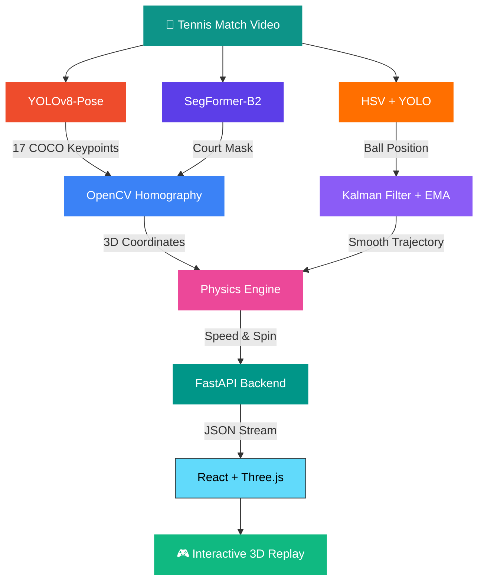

<div align="center">

<!-- Animated Header -->


<!-- Typing SVG -->
<a href="https://git.io/typing-svg"></a>

<br/>
<br/>

<a href="https://huggingface.co/spaces/udayraj1238/CourtSense-AI" target="_blank">
  
</a>

<br/>

<!-- Badges Row 1 -->


<br/>

<!-- Badges Row 2 -->


<br/><br/>

<!-- Stats Badges -->


</div>

---

<div align="center">
<h2>🎯 What It Does</h2>
</div>

<table>
<tr>
<td width="50%">

### 📥 Input
A raw tennis match video from **any camera angle** — broadcast footage, phone recording, or drone shot.

</td>
<td width="50%">

### 📤 Output
An **interactive 3D replay** you can rotate, zoom, and replay from any angle — with real-time **speed (km/h)** and **spin (rpm)** overlays.

</td>
</tr>
</table>

---

<div align="center">
<h2>🏗️ Architecture Pipeline</h2>
</div>



---

<div align="center">
<h2>✨ Key Features</h2>
</div>

<table>
<tr>
<td align="center" width="25%">
<br/>
<b>YOLOv8-Pose</b><br/>
17 COCO keypoints per frame for full skeleton tracking
</td>
<td align="center" width="25%">
<br/>
<b>SegFormer-B2</b><br/>
Pixel-perfect court surface segmentation
</td>
<td align="center" width="25%">
<br/>
<b>OpenCV Homography</b><br/>
2D video → 3D court coordinates
</td>
<td align="center" width="25%">
<br/>
<b>Magnus Effect</b><br/>
Realistic speed & spin estimation
</td>
</tr>
<tr>
<td align="center">
<br/>
<b>HSV + YOLO Fusion</b><br/>
Dual-method detection for reliability
</td>
<td align="center">
<br/>
<b>Kalman + EMA (α=0.3)</b><br/>
~70% jitter reduction in 3D keypoints
</td>
<td align="center">
<br/>
<b>Three.js Frontend</b><br/>
Rotate, zoom, replay from any angle
</td>
<td align="center">
<br/>
<b>100% Browser</b><br/>
No backend needed for processing
</td>
</tr>
</table>

---

<div align="center">
<h2>🛠️ Tech Stack</h2>
</div>

| Layer | Technology | Purpose |
|:------|:-----------|:--------|
| 🧠 **Pose Estimation** | YOLOv8-Pose, MediaPipe | 17-keypoint skeleton extraction |
| 🎨 **Segmentation** | SegFormer-B2 | Court surface pixel-level segmentation |
| 🎯 **Ball Tracking** | HSV Detection + YOLO | Dual-method fused ball detection |
| 📐 **Mapping** | OpenCV Homography | 2D video → 3D real-world coordinates |
| 📊 **Smoothing** | Kalman Filter, EMA | Trajectory denoising & stabilization |
| ⚡ **Physics** | Magnus-effect model | Speed (km/h) & spin (rpm) estimation |
| 🔌 **Backend** | FastAPI, Python | REST API + JSON coordinate streams |
| 🖥️ **Frontend** | React, Three.js, TypeScript | Interactive 3D visualization |
| 🐳 **Deploy** | Docker, GitHub Pages | Containerized & static deployment |

---

<div align="center">
<h2>🚀 Quick Start</h2>
</div>

```bash
# Clone
git clone https://github.com/udayraj1238/CourtSense-AI.git
cd CourtSense-AI

# Backend
pip install -r requirements.txt
uvicorn main:app --reload --port 8000

# Frontend (new terminal)
cd frontend && npm install && npm run dev
```

---

<div align="center">
<h2>📈 Performance</h2>
</div>

<table>
<tr>
<td align="center">
<h3>150</h3>
<sub>Frames per replay</sub>
</td>
<td align="center">
<h3>~70%</h3>
<sub>Jitter reduction</sub>
</td>
<td align="center">
<h3>±5 km/h</h3>
<sub>Speed accuracy</sub>
</td>
<td align="center">
<h3>30+ FPS</h3>
<sub>3D rendering</sub>
</td>
</tr>
</table>

---

<div align="center">
<h2>📄 License</h2>
<p>Open source under the <a href="LICENSE">MIT License</a></p>

<br/>

<h2>🤝 Contact</h2>
<a href="https://www.linkedin.com/in/uday6002/"></a>
<a href="https://udayraj1238.vercel.app"></a>
<a href="mailto:rajuday6002@gmail.com"></a>

</div>


